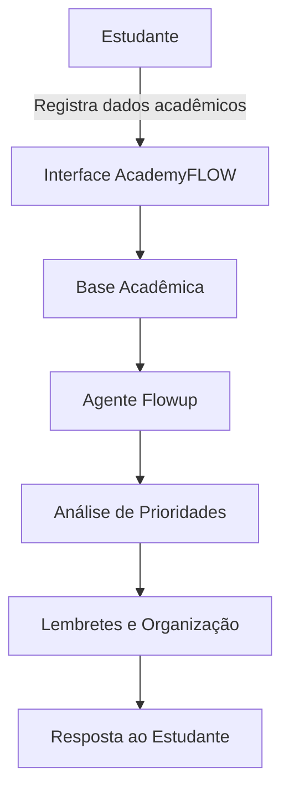

# 🎓 AcademyFLOW — Assistente Acadêmico Inteligente

> Sistema inteligente voltado para organização acadêmica, acompanhamento de disciplinas, provas, trabalhos, lembretes e prioridades de estudo.

---

## 💡 O Problema

Estudantes lidam com várias demandas ao mesmo tempo: disciplinas diferentes, provas, trabalhos, atividades complementares, segunda chamada, recuperação, dependências, observações importantes e prazos que mudam durante o semestre.

Muitas vezes essas informações ficam espalhadas em grupos de WhatsApp, e-mails, plataformas acadêmicas, calendário, caderno e anotações soltas. Isso aumenta o risco de esquecimento, atraso, ansiedade e dificuldade para definir prioridades.

---

## ✅ A Solução

O **AcademyFLOW** é uma proposta de sistema inteligente para ajudar estudantes a organizar sua rotina acadêmica de forma prática e centralizada.

O sistema poderá:

- Registrar disciplinas e matérias a serem estudadas
- Cadastrar provas, trabalhos, atividades, segunda chamada, recuperação e DP
- Criar observações livres sobre qualquer assunto acadêmico
- Gerar lembretes opcionais
- Integrar, quando possível, com calendário do usuário
- Organizar prioridades com apoio de um agente chamado **Flowup**
- Permitir interação por texto e, futuramente, por voz
- Ajudar o estudante a entender o que precisa ser feito primeiro

---

## 👤 Persona do Agente

| Atributo | Detalhe |
|---|---|
| Nome | Flowup |
| Personalidade | Organizado, didático, calmo e objetivo |
| Tom de voz | Claro, acolhedor e prático |
| Público-alvo | Estudantes que precisam organizar rotina acadêmica |
| Objetivo | Ajudar o usuário a priorizar tarefas, estudos e prazos |

---

## 🗂️ Estrutura Inicial do Projeto

```text
📁 academyflow/
├── 📁 docs/
│   ├── 01-documentacao-sistema.md
│   ├── 02-base-conhecimento.md
│   ├── 03-prompts-flowup.md
│   ├── 04-metricas.md
│   └── 05-roadmap.md
├── 📁 data/
│   ├── disciplinas.json
│   ├── atividades.json
│   ├── calendario_academico.json
│   └── lembretes.json
├── 📁 src/
│   └── app.py
└── README.md
```

---

## 🧠 Arquitetura Proposta



---

## 📁 Base de Conhecimento

| Arquivo | Conteúdo |
|---|---|
| `disciplinas.json` | Nome das matérias, professor, carga horária, status e observações |
| `atividades.json` | Trabalhos, provas, seminários, segunda chamada, recuperação e DP |
| `calendario_academico.json` | Datas importantes do semestre |
| `lembretes.json` | Lembretes criados pelo usuário |

> A base de conhecimento deverá ser alimentada pelo próprio estudante e usada pelo agente Flowup para gerar orientações personalizadas.

---

## 🛡️ Segurança, Privacidade e Limitações

- Não solicita dados sensíveis desnecessários
- Não expõe informações pessoais do estudante
- Não inventa prazos ou atividades que não estejam cadastrados
- Quando não houver informação suficiente, informa a limitação
- Permite que o estudante revise e edite os dados registrados
- Atua como apoio de organização, não como substituto da responsabilidade acadêmica do usuário

---

## 📊 Métricas de Avaliação

| Métrica | Meta |
|---|---|
| Organização das informações | ≥ 4/5 |
| Clareza nas prioridades | ≥ 4/5 |
| Facilidade de uso | ≥ 4/5 |
| Confiabilidade dos lembretes | 5/5 |
| Aderência ao escopo acadêmico | 5/5 |

---

## 🛠️ Tecnologias Possíveis

- Python
- Streamlit
- SQLite ou JSON para protótipo inicial
- Integração futura com Google Calendar ou Outlook Calendar
- Reconhecimento de voz local ou gratuito, quando possível
- Agente com IA local/free, evitando custos com API

---

## ▶️ Como Rodar

```bash
pip install -r requirements.txt
streamlit run src/app.py
```

---

## 📄 Documentação

| Doc | Descrição |
|---|---|
| [01 — Documentação do Sistema](docs/01-documentacao-sistema.md) | Problema, solução, público-alvo e funcionalidades |
| [02 — Base de Conhecimento](docs/02-base-conhecimento.md) | Dados usados pelo sistema e estratégia de integração |
| [03 — Prompts Flowup](docs/03-prompts-flowup.md) | Persona, regras e exemplos de interação |
| [04 — Métricas](docs/04-metricas.md) | Critérios de avaliação e testes |
| [05 — Roadmap](docs/05-roadmap.md) | Evolução planejada do projeto |

---

## 🚀 Roadmap Inicial

| Fase | Entrega |
|---|---|
| 1 | Documentação do projeto |
| 2 | Estrutura da base de dados |
| 3 | Protótipo da interface |
| 4 | Cadastro de disciplinas e atividades |
| 5 | Lembretes e prioridades |
| 6 | Agente Flowup |
| 7 | Integração com calendário |
| 8 | Entrada por voz |

---

> Projeto idealizado para apoiar estudantes na organização acadêmica com tecnologia, IA e uma experiência simples, acessível e prática.
