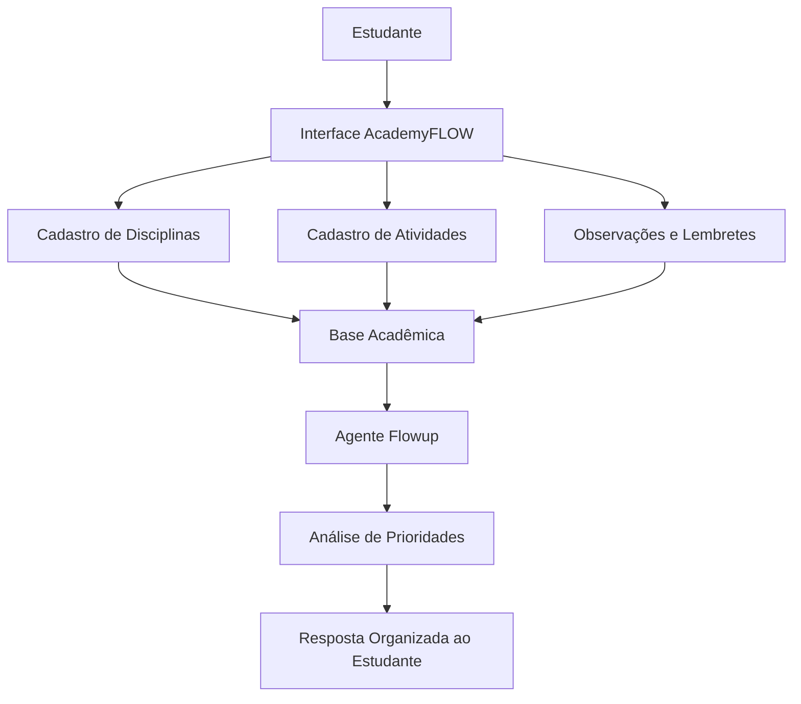

# 01 — Documentação do Sistema

## 🎓 AcademyFLOW — Assistente Acadêmico Inteligente

O **AcademyFLOW** é uma proposta de sistema inteligente para apoiar estudantes na organização da rotina acadêmica, centralizando disciplinas, atividades, provas, lembretes, observações e prioridades de estudo em um único ambiente.

A ideia principal é reduzir a desorganização causada por informações espalhadas em diferentes canais, como grupos de mensagens, e-mails, plataformas acadêmicas, calendários e anotações soltas.

---

## 💡 Problema

Estudantes precisam lidar com várias responsabilidades ao mesmo tempo durante o semestre, como:

- Disciplinas em andamento
- Provas presenciais ou online
- Trabalhos acadêmicos
- Seminários
- Atividades avaliativas
- Segunda chamada
- Recuperação
- Dependência/DP
- Prazos institucionais
- Matérias que precisam ser revisadas
- Observações importantes feitas por professores

Quando essas informações não estão organizadas, o estudante pode esquecer prazos, estudar em cima da hora, perder atividades importantes ou sentir dificuldade para decidir o que fazer primeiro.

---

## ✅ Solução Proposta

O **AcademyFLOW** propõe uma plataforma simples e inteligente para registrar, acompanhar e priorizar demandas acadêmicas.

O sistema deverá permitir que o estudante cadastre suas informações acadêmicas e receba apoio do agente **Flowup**, responsável por ajudar na organização e priorização das tarefas.

O objetivo não é substituir a responsabilidade do estudante, mas atuar como um apoio para melhorar a gestão da rotina de estudos.

---

## 👤 Público-Alvo

O AcademyFLOW é voltado para:

- Estudantes universitários
- Estudantes de cursos técnicos
- Estudantes de ensino médio
- Pessoas que estudam online ou em modelo híbrido
- Pessoas com dificuldade de organização acadêmica
- Estudantes que conciliam estudo, trabalho e vida pessoal

---

## 🤖 Agente Flowup

O **Flowup** será o agente inteligente do AcademyFLOW.

Ele terá a função de interpretar os dados cadastrados pelo estudante e responder perguntas como:

- O que tenho para fazer hoje?
- Qual atividade é mais urgente?
- Tenho alguma prova próxima?
- Quais matérias preciso estudar esta semana?
- Tenho alguma segunda chamada, recuperação ou DP pendente?
- Quais tarefas estão atrasadas?
- O que devo priorizar agora?

---

## 🧭 Funcionalidades Principais

### Cadastro de Disciplinas

O sistema deverá permitir registrar informações como:

- Nome da disciplina
- Professor
- Curso ou semestre
- Dias de aula
- Status da disciplina
- Observações gerais

### Cadastro de Atividades

O estudante poderá registrar diferentes tipos de demandas acadêmicas:

- Prova
- Trabalho
- Seminário
- Atividade complementar
- Leitura obrigatória
- Segunda chamada
- Recuperação
- DP
- Revisão de conteúdo
- Outro tipo de atividade

### Campo de Observações

O sistema deverá possuir um campo aberto para observações livres, permitindo registrar qualquer informação relevante, como:

- Recados de professores
- Mudança de data
- Conteúdos importantes
- Links úteis
- Orientações específicas
- Anotações pessoais

### Lembretes

O usuário poderá escolher se deseja ou não criar lembretes para determinadas atividades ou observações.

Os lembretes poderão ser usados para alertar sobre:

- Prazos próximos
- Provas
- Entregas de trabalhos
- Revisões de estudo
- Segunda chamada
- Recuperação
- DP

### Priorização Inteligente

O agente Flowup deverá organizar as prioridades com base em critérios como:

- Data de entrega
- Grau de urgência
- Tipo de atividade
- Status da tarefa
- Tempo disponível
- Importância acadêmica

---

## 🧠 Arquitetura Conceitual

---

## 🗂️ Dados Iniciais do Sistema

A base inicial poderá ser composta por arquivos simples, como JSON, para facilitar o desenvolvimento do protótipo.

| Arquivo | Finalidade |
|---|---|
| `disciplinas.json` | Armazenar as disciplinas cadastradas |
| `atividades.json` | Armazenar provas, trabalhos, seminários e demais tarefas |
| `calendario_academico.json` | Guardar datas importantes do semestre |
| `lembretes.json` | Registrar lembretes configurados pelo usuário |
| `observacoes.json` | Guardar observações livres vinculadas ou não a disciplinas |

---

## 🛡️ Regras de Segurança e Privacidade

O AcademyFLOW deverá seguir algumas regras importantes:

1. Não solicitar dados sensíveis desnecessários.
2. Não expor informações pessoais do estudante.
3. Não inventar prazos, notas ou atividades que não estejam cadastradas.
4. Informar quando não houver dados suficientes para responder.
5. Permitir que o estudante revise, edite ou exclua informações cadastradas.
6. Não tomar decisões acadêmicas pelo estudante.
7. Atuar como apoio de organização, não como substituto da instituição de ensino.

---

## ⚠️ Limitações do Sistema

O AcademyFLOW depende da qualidade dos dados inseridos pelo usuário.

Se o estudante não cadastrar uma prova, atividade ou prazo, o sistema não deverá inventar essa informação. Nesses casos, o Flowup deverá responder de forma transparente, explicando que não encontrou dados suficientes.

Exemplo:

> Não encontrei nenhuma prova cadastrada para esta semana. Confira se todas as datas foram registradas corretamente.

---

## 📌 Requisitos Funcionais Iniciais

| Código | Requisito |
|---|---|
| RF01 | Permitir cadastro de disciplinas |
| RF02 | Permitir cadastro de atividades acadêmicas |
| RF03 | Permitir cadastro de provas, trabalhos, segunda chamada, recuperação e DP |
| RF04 | Permitir registro de observações livres |
| RF05 | Permitir criação opcional de lembretes |
| RF06 | Listar atividades pendentes |
| RF07 | Identificar atividades próximas do prazo |
| RF08 | Permitir consulta ao agente Flowup |
| RF09 | Exibir prioridades acadêmicas |
| RF10 | Permitir edição e exclusão de registros |

---

## 📌 Requisitos Não Funcionais Iniciais

| Código | Requisito |
|---|---|
| RNF01 | Interface simples e intuitiva |
| RNF02 | Linguagem clara e acessível |
| RNF03 | Armazenamento local ou gratuito no protótipo |
| RNF04 | Baixo custo de implementação |
| RNF05 | Possibilidade de evolução para integração com calendário |
| RNF06 | Respostas do agente com transparência e sem invenção de dados |

---

## 🚀 Evolução Prevista

A evolução do AcademyFLOW poderá ocorrer em fases:

1. Documentação inicial do projeto
2. Estruturação da base de dados
3. Protótipo simples da interface
4. Cadastro de disciplinas e atividades
5. Criação de lembretes
6. Implementação do agente Flowup
7. Organização automática de prioridades
8. Integração com calendário
9. Entrada de dados por voz
10. Resposta por texto e voz

---

## ✅ Resultado Esperado

Ao final do desenvolvimento, espera-se que o AcademyFLOW ajude estudantes a visualizar melhor sua rotina acadêmica, reduzir esquecimentos, organizar prazos e tomar decisões mais conscientes sobre o que estudar ou entregar primeiro.

O projeto une organização acadêmica, inteligência artificial e tecnologia acessível para criar uma ferramenta prática, útil e alinhada às necessidades reais de estudantes.
